# Interactive Virtual Server Room Network Simulation using VR Technology

A Final Year Project developed as part of the Bachelor of Engineering (Computer Engineering) program at King Mongkut's Institute of Technology Ladkrabang (KMITL).

## Project Overview

VR Networking Education is a virtual reality learning platform designed to help beginners understand computer networking concepts through immersive and interactive experiences.

The project focuses on visualizing networking concepts such as network topology, packet flow, device connectivity, and infrastructure management in a VR environment.

## Objectives
* Improve networking education through immersive learning
* Provide hands-on interaction with networking devices
* Help learners visualize abstract networking concepts
* Increase engagement compared to traditional learning methods

## Key Features

Virtual Server Room Design
* Design and customize server room layouts
* Configure room dimensions and equipment placement
* Place racks, servers, network devices, and supporting infrastructure according to real-world constraints

Real-Time Infrastructure Simulation
* Real-time heat distribution simulation based on equipment placement
* Power consumption estimation using device utilization and operational characteristics
* Environmental impact visualization to support infrastructure planning decisions

Network Infrastructure Configuration
* Configure IP interfaces for network devices
* Create static routing tables
* Define firewall rules and security policies
* Configure load balancing pools and algorithms (Round Robin)

Traffic & Resource Simulation
* Organize and route cables within the server room
* Auto apply labels to devices and cable connections

Fire Safety Simulation
* Smoke detection system
* Fire alarm, horn, and strobe warning systems
* Fire suppression simulation using discharge nozzles
* Fire safety scenarios

Interactive Learning System
* Device usage guides and tutorials
* Interactive equipment information
* In-application guidance for system features and user interfaces

Realistic Equipment Representation
* Realistic 3D models based on actual networking and server room equipment
* Equipment placement and interaction inspired by real-world deployment practices

## Screenshots
Main Menu
| MainMenu1 | MainMenu2 | MainMenu3 |
|--------|--------|--------|
| [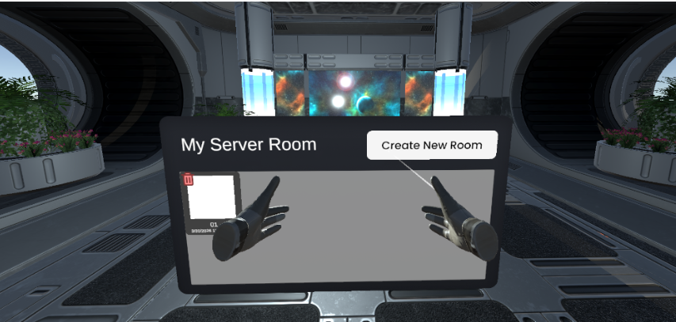](./images/mainmenu1.png) | [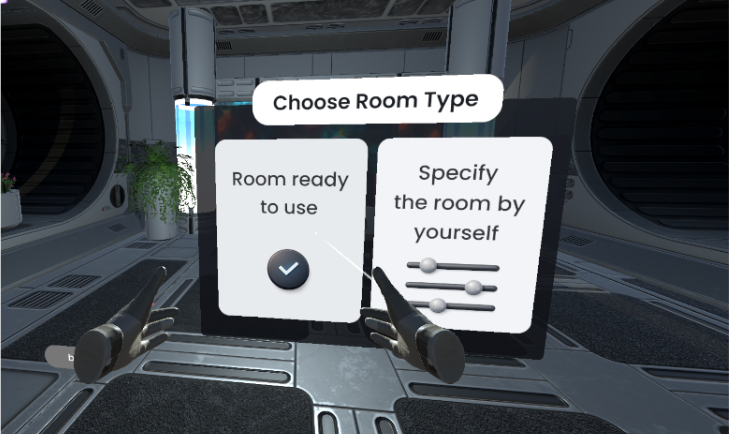](./images/mainmenu2.png) | [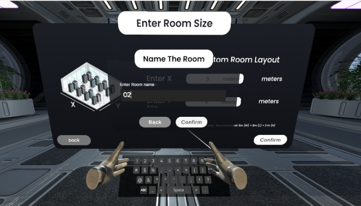](./images/mainmenu4.png) |

Network Configuration
| IP | Firewall | Generate Packet | LB | Route Table |
|--------|--------|--------|--------|--------|
| [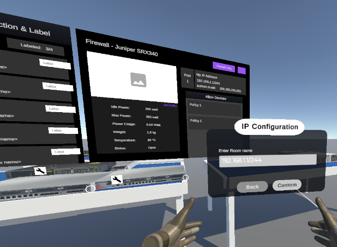](./images/config1.png) | [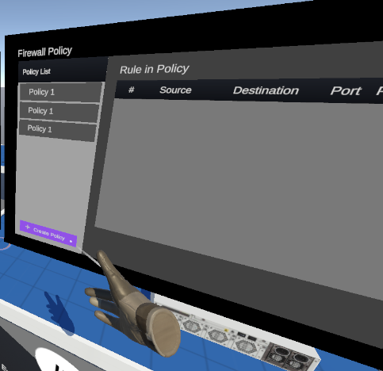](./images/config2.png) | [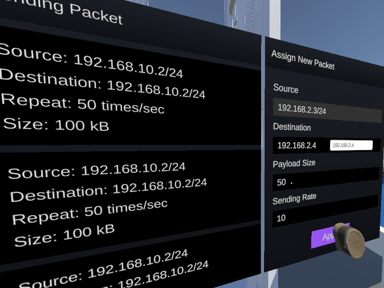](./images/config3.png) | [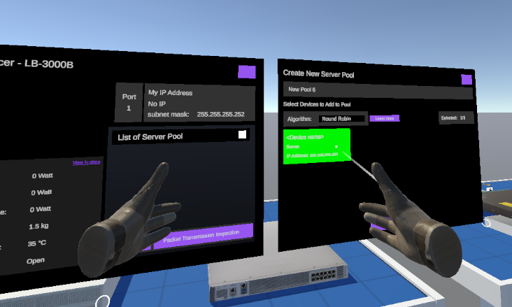](./images/config4.png) | [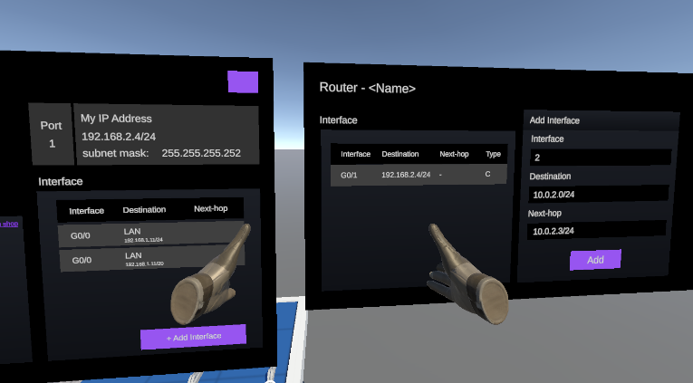](./images/config5.png) | 

Gameplay Exmaple
| Ex1 | Ex2 | Ex3 | Ex4 |
|--------|--------|--------|--------|
|[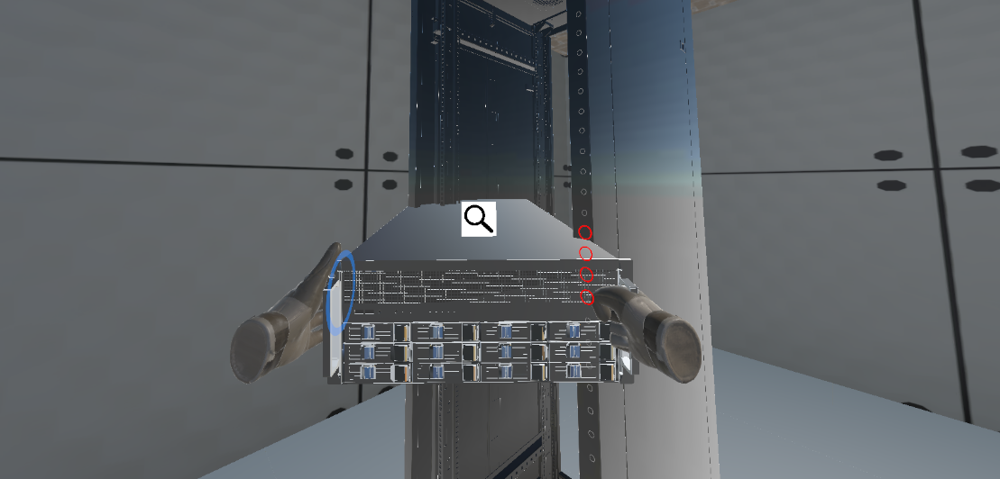](./images/play1.png) | [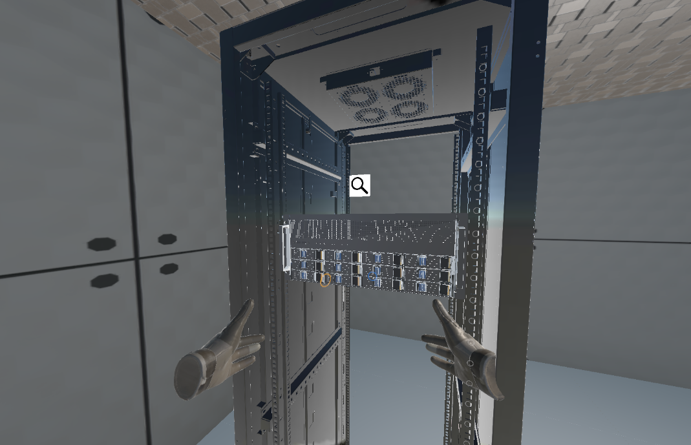](./images/play2.png) | [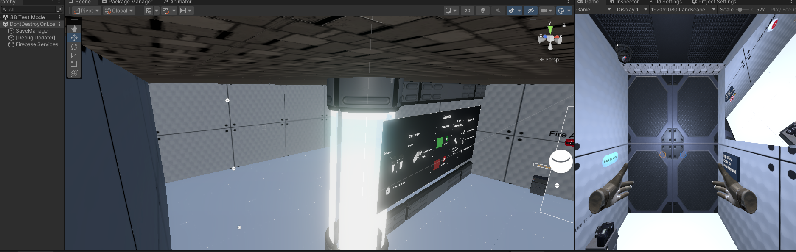](./images/play3.png) | [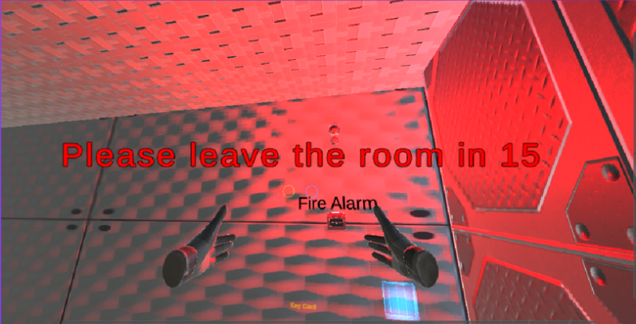](./images/play4.png) |
| Ex5 | Ex6 | Ex7 | Ex8 |
|[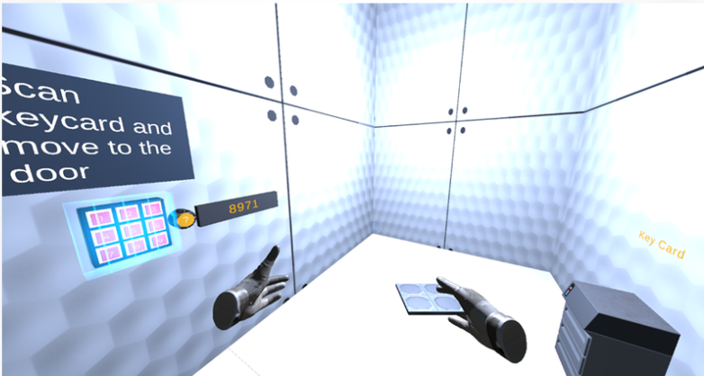](./images/play5.png) | [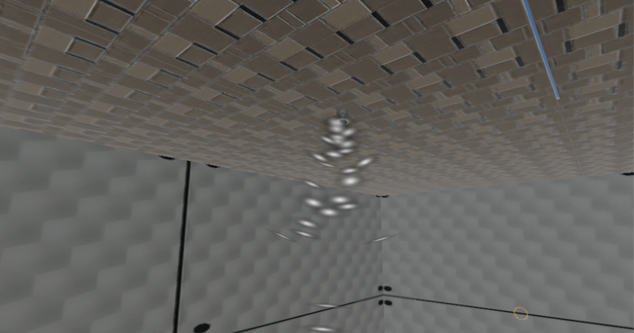](./images/play6.png) | [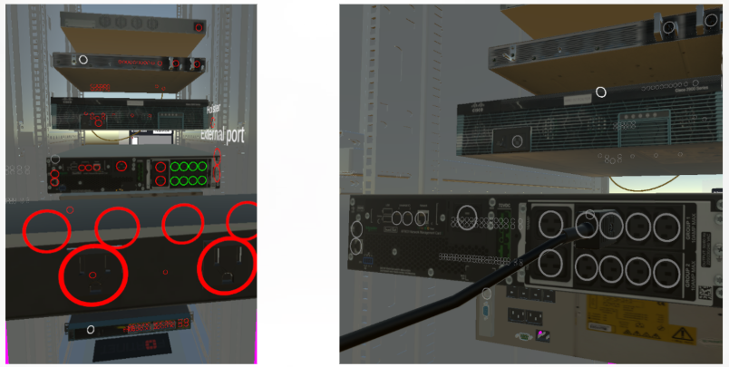](./images/play7.png) | [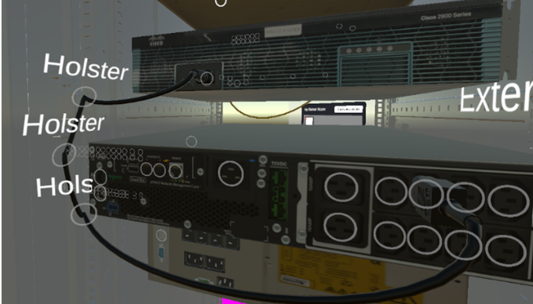](./images/play8.png) |

3D Models Example
| Ex1 | Ex2 | Ex3 |
|--------|--------|--------|
|[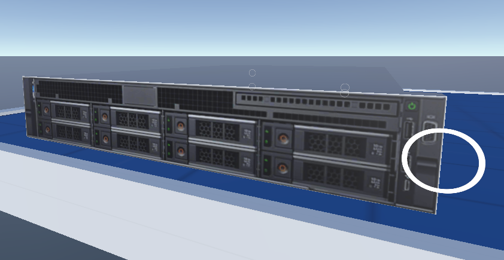](./images/example1.png) |  | [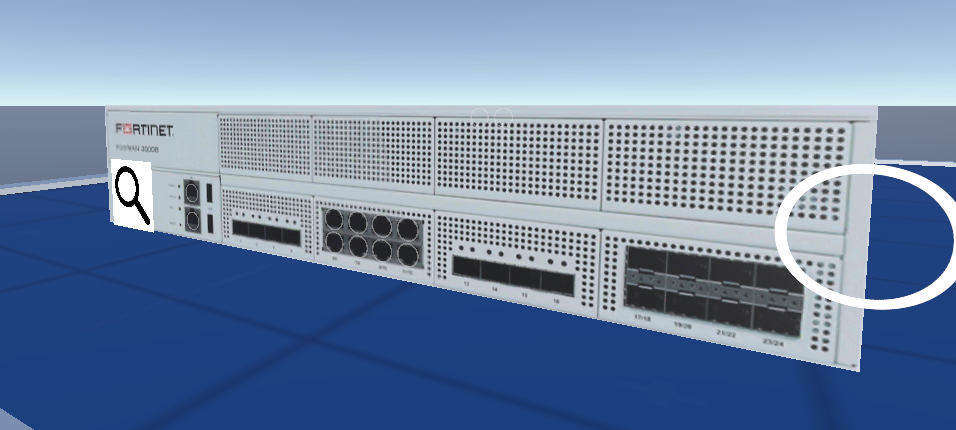](./images/example3.png) |

## My Contributions
As one of the project developers, my responsibilities included:
* System architecture design
* Cloud architecture planning
* AWS service integration
* Backend communication design
* Project research and documentation
* Feature implementation and testing

## Team Members

| GitHub | Role |
|--------|--------|
| plubdulq | Cloud Architecture, System Design, UI/UX, Development |
| chompoosirinya | VR Development, System Design, UI/UX, Development |
| DfrostG | VR Development, UI/UX, Development |

## Repository Note

This repository represents the project portfolio and documentation.

Future Improvements
* Advanced networking simulations
* Make heat and power realtime-calculation more accurate
* Additional challenge scenarios
* Make board summary all data for user to evaluation
* Multi-user learning environments
